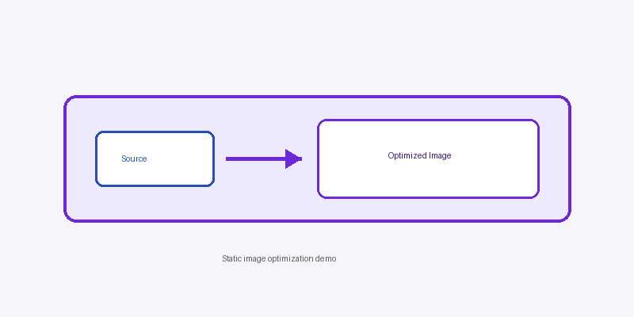

import Image from 'next/image'
import nextraDemo from '../../../public/nextra-demo.png'

# Image Optimization

**Evidence:** Nextra's `staticImage` support and static imports provide image
dimensions plus stable authoring, lazy-loading, and layout behavior. In this
specific GitHub Pages deployment, however, production configuration sets
`images: { unoptimized: true }`.

That means the export does **not** perform Next.js image resizing, format
conversion, or optimizer requests. The authoring and layout benefits remain,
but image optimization is **partial** for this deployment.

You can also use `next/image` directly when you want full control over props:

<Image src={nextraDemo} alt="Nextra banner" width={1200} height={630} />

> **Hands-on finding (subjective):** Static-export image authoring and layout
> behavior felt good in this sample.

See [Asset Placement](/en/criteria/asset-placement) for where these two images
live, and the [assessment](/en/assessment) for the deployment trade-off.
