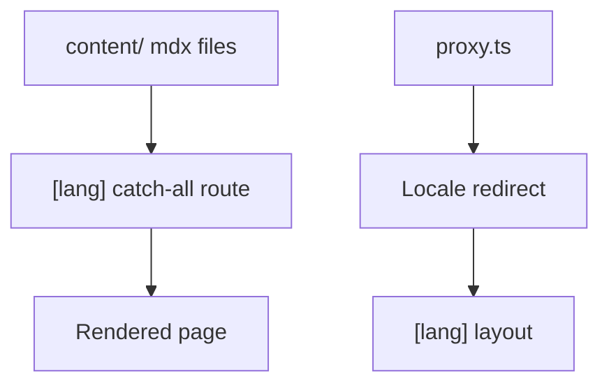

# Repository / Directory Complexity

> **Hands-on finding (subjective):** Compared with VitePress, Nextra's quick
> start was materially more involved in this evaluation. It requires Next.js,
> React, Nextra, and its theme, plus configuration and App Router
> layout/catch-all/MDX wiring. That is an integration trade-off rather than a
> claim that every Nextra project is difficult.

This bilingual GitHub Pages sample adds further deployment-specific pieces:

- An App Router catch-all route, `app/[lang]/[[...mdxPath]]/page.tsx`, that resolves any MDX path under a given locale to a rendered page.
- A `content/<locale>/` directory (`content/en/`, `content/ja/`) holding the actual MDX source files, kept separate from the routing code.
- A static-export root redirect workaround; static hosting cannot run the
  normal locale-detection middleware.
- Pagefind indexing and export/base-path configuration for GitHub Pages.
- Per-locale UI text dictionaries under `app/_dictionaries/` (for example `en.ts` and `ja.ts`), used for chrome text such as the banner, footer, search placeholders, and theme switch labels.
- Theme configuration — navbar, footer, sidebar behavior, search, and the locale switcher — assembled once in the root `app/[lang]/layout.tsx`.

**Evidence in this repository:** the files above make the moving parts
inspectable. Together they make this bilingual static deployment more involved
than a minimal single-language site, while still keeping responsibilities
separate and understandable.

See the [assessment](/en/assessment) for the decision context.

