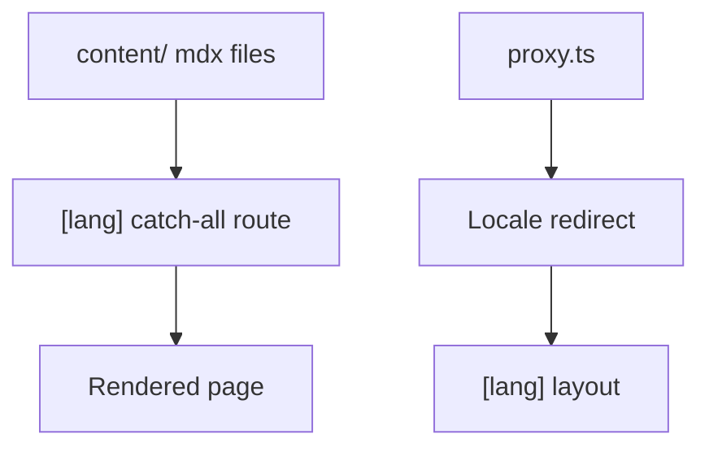

# Repository / Directory Complexity

Wiring up i18n, the App Router, and content authoring together in this project required several distinct moving parts:

- An App Router catch-all route, `app/[lang]/[[...mdxPath]]/page.tsx`, that resolves any MDX path under a given locale to a rendered page.
- A `content/<locale>/` directory (`content/en/`, `content/ja/`) holding the actual MDX source files, kept separate from the routing code.
- A `proxy.ts` file that re-exports `proxy` from `nextra/locales` to detect the visitor's preferred locale and redirect accordingly.
- Per-locale UI text dictionaries under `app/_dictionaries/` (for example `en.ts` and `ja.ts`), used for chrome text such as the banner, footer, search placeholders, and theme switch labels.
- Theme configuration — navbar, footer, sidebar behavior, search, and the locale switcher — assembled once in the root `app/[lang]/layout.tsx`.

This adds up to **moderate** complexity: more moving parts than a single-language, single-content-folder setup, but each piece has a clear, single responsibility (routing, content, locale detection, translated strings, or theme), so the overall structure stays easy to reason about once you know the five pieces above.

