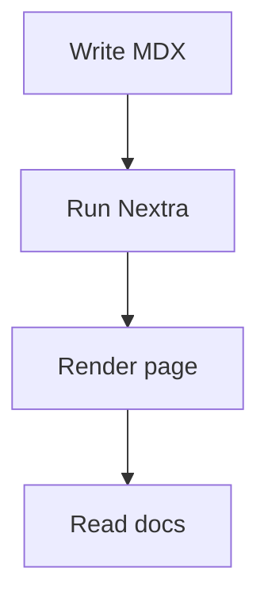
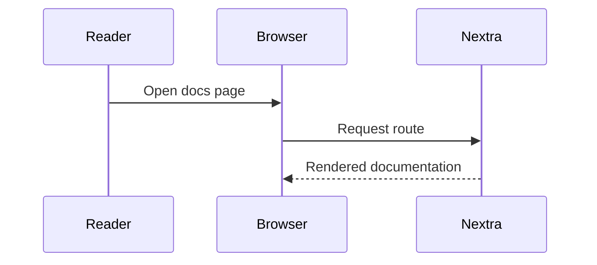
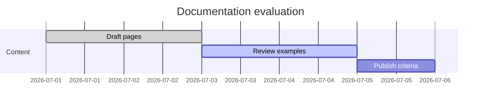

# Mermaid 図

Nextra はページレベルの追加設定なしに `mermaid` コードフェンスを図としてレンダリングします。

## フローチャート

```mermaid
flowchart TD
  A[Write MDX] --> B[Run Nextra]
  B --> C[Render page]
  C --> D[Read docs]
```

## シーケンス図

```mermaid
sequenceDiagram
  participant Reader
  participant Browser
  participant Nextra
  Reader->>Browser: Open docs page
  Browser->>Nextra: Request route
  Nextra-->>Browser: Rendered documentation
```

## ガントチャート

```mermaid
gantt
  title Documentation evaluation
  dateFormat  YYYY-MM-DD
  section Content
  Draft pages       :done,    draft, 2026-07-01, 2d
  Review examples   :active,  review, after draft, 2d
  Publish criteria  :         publish, after review, 1d
```
