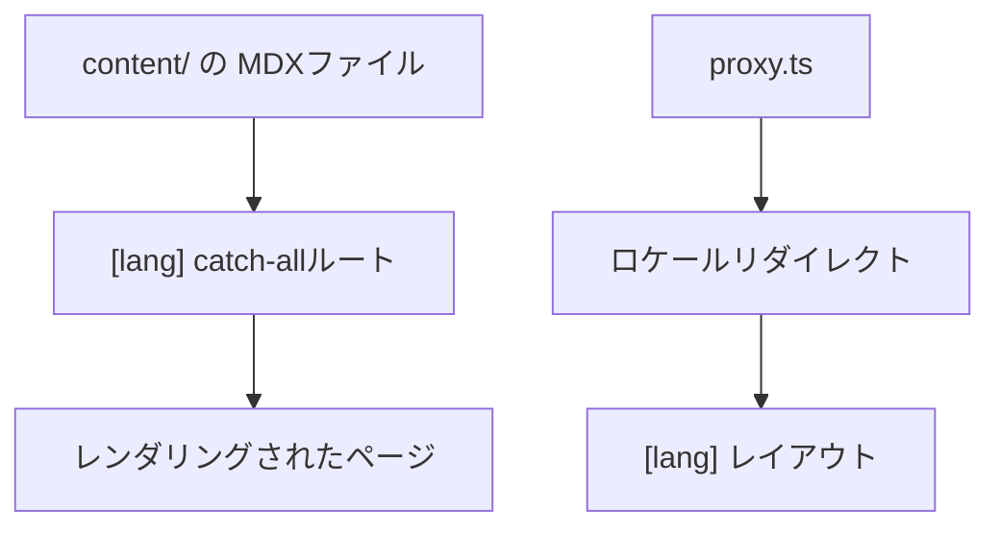

# リポジトリ・ディレクトリの複雑度

> **ハンズオンでの所見（主観）:** 今回の評価では、Nextra のクイックスタートは
> VitePress より明確に手数が多く感じられました。Next.js、React、Nextra、テーマに加え、
> 設定、App Router の layout/catch-all/MDX の配線が必要です。これは統合上の
> トレードオフであり、すべての Nextra プロジェクトが難しいという意味ではありません。

この GitHub Pages 向けの二言語サンプルには、さらにデプロイ固有の要素があります。

- App Router の catch-all ルート `app/[lang]/[[...mdxPath]]/page.tsx` ——
  各ロケール配下の任意のMDXパスを解決し、レンダリングされたページとして返す。
- `content/<locale>/`（`content/en/`、`content/ja/`）ディレクトリ —— 実際の
  MDXソースファイルを保持し、ルーティング用のコードとは分離されている。
- 静的エクスポートで通常のロケール判定ミドルウェアを実行できないことを補う、
  ルートのリダイレクト処理。
- GitHub Pages 用の Pagefind インデックスと export/basePath 設定。
- `app/_dictionaries/` 配下のロケール別UI文言辞書（例: `en.ts`、`ja.ts`）——
  バナー・フッタ・検索プレースホルダー・テーマ切替ラベルなど、UI側の文言に
  使われる。
- ルートの `app/[lang]/layout.tsx` で一括して組み立てられるテーマ設定 ——
  ナビバー・フッタ・サイドバーの挙動・検索・ロケールスイッチなど。

**このリポジトリで確認できる事実:** 上記のファイルにより、構成要素は実際に
確認できます。単一言語の最小構成より部品数は多い一方、ルーティング、コンテンツ、
翻訳文言、テーマの責務は分離されており、把握すれば追いやすい構造です。

選定の文脈は [評価](/ja/assessment) を参照してください。

