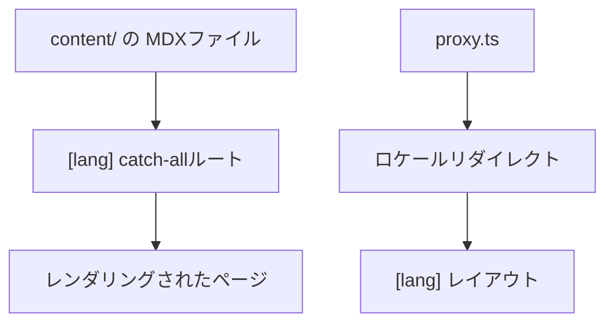

# リポジトリ・ディレクトリの複雑度

このプロジェクトで i18n・App Router・コンテンツを配線するには、いくつかの
独立した構成要素が必要だった。

- App Router の catch-all ルート `app/[lang]/[[...mdxPath]]/page.tsx` ——
  各ロケール配下の任意のMDXパスを解決し、レンダリングされたページとして返す。
- `content/<locale>/`（`content/en/`、`content/ja/`）ディレクトリ —— 実際の
  MDXソースファイルを保持し、ルーティング用のコードとは分離されている。
- `proxy.ts` —— `nextra/locales` から `proxy` を re-export し、訪問者の優先
  ロケールを判定してリダイレクトする。
- `app/_dictionaries/` 配下のロケール別UI文言辞書（例: `en.ts`、`ja.ts`）——
  バナー・フッタ・検索プレースホルダー・テーマ切替ラベルなど、UI側の文言に
  使われる。
- ルートの `app/[lang]/layout.tsx` で一括して組み立てられるテーマ設定 ——
  ナビバー・フッタ・サイドバーの挙動・検索・ロケールスイッチなど。

これらを合わせると**中程度**の複雑度と評価できる。単一言語・単一コンテンツ
フォルダの構成と比べれば部品数は多いが、各部品の責務（ルーティング、
コンテンツ、ロケール判定、翻訳文言、テーマ）は明確に分離されているため、
上記5点さえ把握すれば全体の構造は追いやすい。

