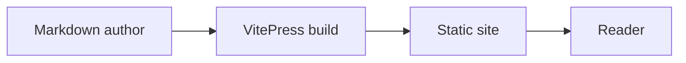
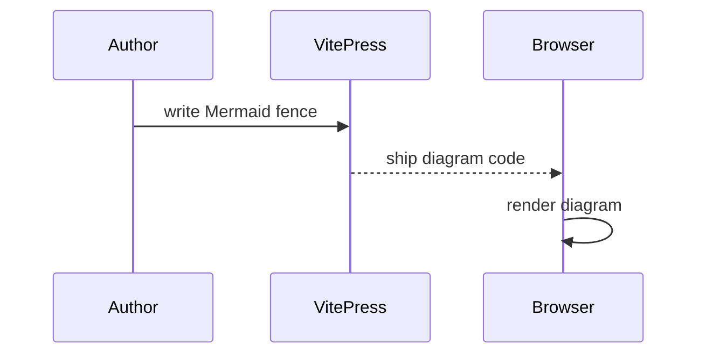
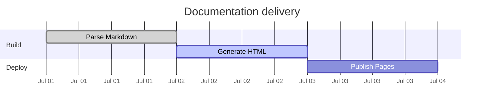

# Mermaid

**Plugin support:** this site uses the third-party, non-core
[`vitepress-plugin-mermaid`](https://emersonbottero.github.io/vitepress-plugin-mermaid/).
It turns fenced `mermaid` blocks into diagrams in the static site and loads
the renderer for the browser.

## Flowchart

## Sequence diagram

## Gantt chart

Use normal Mermaid syntax in the fence; it is not a native VitePress renderer.
The plugin configuration is in `.vitepress/config.ts`.

## Sustainability and upgrade boundary

As checked 2026-07-11, the latest [npm package](https://www.npmjs.com/package/vitepress-plugin-mermaid)
is 2.0.17 (published 2024-09-24), whereas the latest GitHub
[release/tag](https://github.com/emersonbottero/vitepress-plugin-mermaid/releases)
is V2.0.8 (2022-09-24); the
[repository](https://github.com/emersonbottero/vitepress-plugin-mermaid) shows
a latest commit on 2025-04-16. That npm/release-history divergence calls for
review, not a claim that the package is unmaintained or insecure.

### Maintenance assessment (opinion)

I treat the divergence as a negative sign of inadequate release-management
discipline. It makes ongoing maintenance intent difficult to judge and leaves
a realistic risk that the plugin could become effectively unmaintained without
a clear signal. This is a negative selection factor, not proof of the
maintainer's intent or the package's security state.

The plugin declares a VitePress 1 peer range, not v2, so it is unsupported
with VitePress 2. This sample pins VitePress 2.0.0-alpha.18 and its static
build currently succeeds, but that is project test evidence rather than an
upstream support declaration. Lock versions, audit the dependency, and test
upgrades. See the [assessment](/en/assessment) for the same dated maintenance
snapshot.
