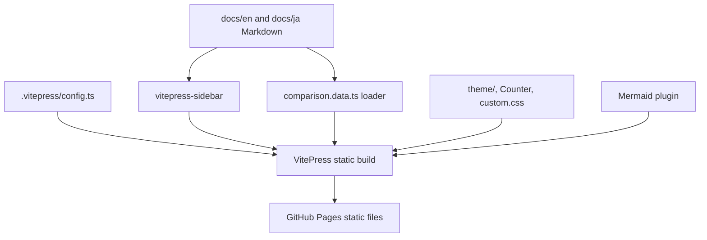

# Repository Complexity

This bilingual VitePress setup is **moderate** in complexity, but that is not
VitePress's baseline. The official wizard can add VitePress to an existing
product repository with a nested `docs/` directory, one `.vitepress/config`,
and `docs:dev`, `docs:build`, and `docs:preview` scripts; no separate
documentation repository is required. Locales, theme code, the auto-sidebar
plugin, Mermaid plugin, and local data loader are deliberate additions in this
sample.

| Area | Responsibility |
| --- | --- |
| `docs/en/`, `docs/ja/` | Locale-specific authored content |
| `.vitepress/config.ts` | Base path, locale UI, search, Markdown, and plugins |
| `.vitepress/theme/` | Default-theme extension, global `Counter`, CSS |
| `.vitepress/comparison.data.ts` | Typed build-time frontmatter summary |

There is no custom application router or server API. Keeping integrations in
the VitePress configuration makes the extra complexity explicit and bounded.
See the dated [assessment](/en/assessment) for the baseline-versus-sample and
plugin-maintenance trade-offs.
