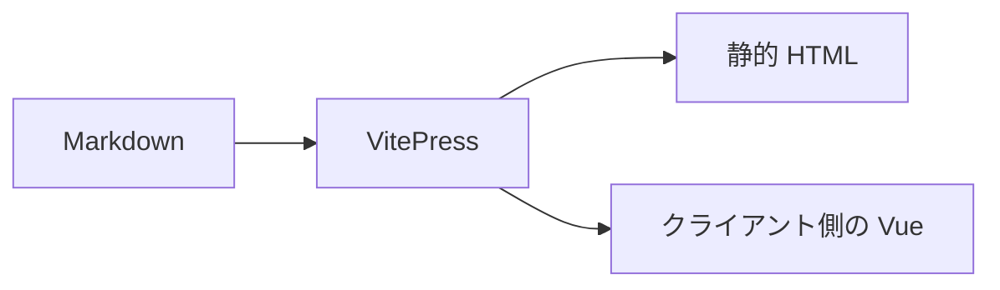
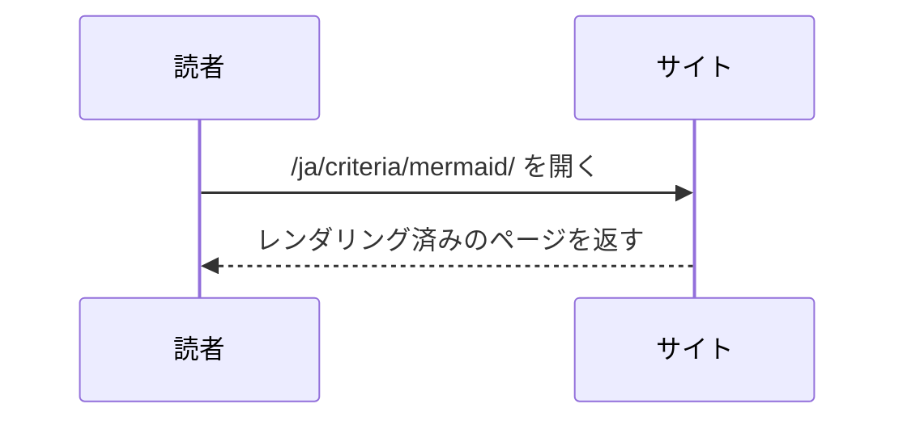
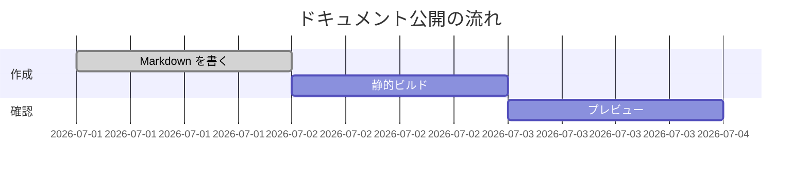

# Mermaid 図

**対応状況: プラグイン。** Mermaid のフェンスは、VitePress 本体ではないサードパーティーの [`vitepress-plugin-mermaid`](https://emersonbottero.github.io/vitepress-plugin-mermaid/) によってレンダリングされます。VitePress 本体だけの Markdown 機能ではありません。

## フロー

## シーケンス

## ガント

図のテーマとセキュリティ設定は `.vitepress/config.ts` で管理されます。本文では対応する `mermaid` コードフェンスだけを使用します。

## 持続可能性とアップグレードの境界

2026-07-11 時点で、最新の [npm パッケージ](https://www.npmjs.com/package/vitepress-plugin-mermaid)は 2.0.17（2024-09-24 公開）ですが、最新の GitHub [Release/tag](https://github.com/emersonbottero/vitepress-plugin-mermaid/releases) は V2.0.8（2022-09-24）です。[リポジトリー](https://github.com/emersonbottero/vitepress-plugin-mermaid)の最新コミットは 2025-04-16 です。この npm と Release 履歴の乖離は確認すべきですが、パッケージが保守されていない、または安全でないという主張の根拠にはなりません。

### 保守性に関する判断（主観）

この乖離は、適切なリリース管理が行われていないことを示すマイナスのシグナルと評価します。継続的な保守が優先されているかを判断しにくく、明確な告知がないまま実質的にメンテナンスされなくなるリスクも現実的です。これはメンテナーの意図やパッケージの安全性を事実として断定するものではなく、選定上のマイナスポイントです。

プラグインの peer range は VitePress 1 を宣言しており v2 ではないため、VitePress 2 ではサポートされません。このサンプルは VitePress 2.0.0-alpha.18 を固定しており静的ビルドは現在成功していますが、これはプロジェクト内のテスト結果であって upstream によるサポート宣言ではありません。バージョンをロックし、依存関係を監査し、アップグレードをテストします。同じ日付付き保守性スナップショットは[評価](/ja/assessment)を参照してください。
