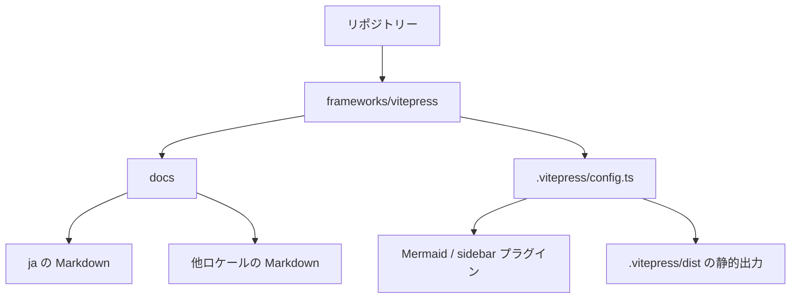

# リポジトリー複雑性

**対応状況: 代替。** VitePress はドキュメント専用の軽量な構成を得意としますが、リポジトリー全体の複雑性を自動で管理する機能ではありません。公式ウィザードでは、既存のプロダクトリポジトリーに入れ子の `docs/`、一つの `.vitepress/config`、`docs:dev`・`docs:build`・`docs:preview` を追加でき、別のドキュメント用リポジトリーは不要です。複数サイトやパッケージは、ワークスペース、複数設定、または複数の VitePress サイトとして設計します。

この図は依存関係を説明する資料であり、VitePress がリポジトリーを解析して生成したものではありません。構成が大きくなるほど、共有コンポーネント、コンテンツ所有者、ビルド境界を明確にします。

::: tip 複雑さを抑える方法
各ロケールの URL とディレクトリーをそろえ、frontmatter の識別子を安定させると、比較用ローダーやナビゲーションを保守しやすくなります。
:::

このサンプルのロケール、テーマコード、サイドバー・Mermaid プラグイン、ローカルデータローダーは、基本構成に意図して追加したものです。基本構成とサンプルの差、プラグイン保守のトレードオフは日付付きの[評価](/ja/assessment)を参照してください。
